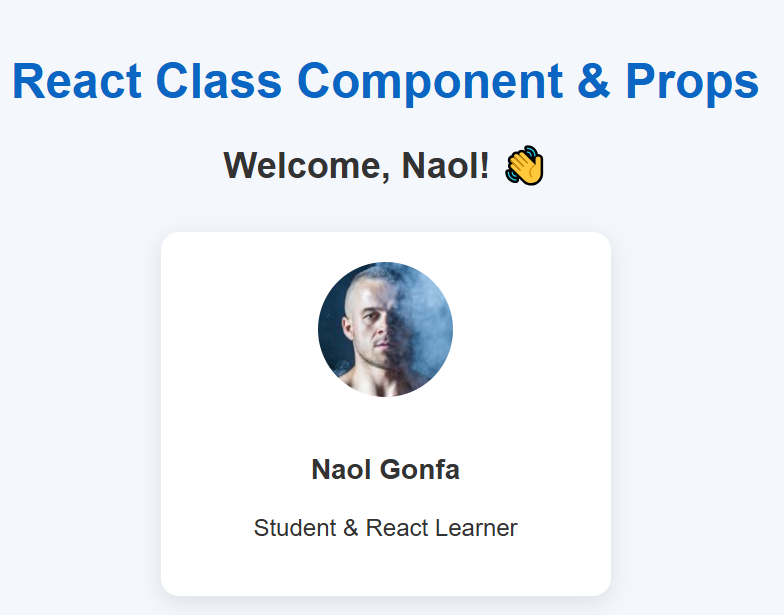

# React Class Components & Props – Mini Project

This project is a small React application built using **Vite**.  
It demonstrates the fundamentals of **Class-Based Components**, **Props**, and **Component Reusability** in React.

---

## 🚀 Project Overview

This mini-project helps you understand:

- How to create **Class Components** in React  
- How to pass **props** from parent to child components  
- How to organize components in a clean folder structure  
- How to style components using an external CSS file  
- How to render multiple components dynamically  

The project is simple, clean, and beginner-friendly — perfect for learning the basics of React (before Hooks).

---

## 📁 Folder Structure

```
React-class-props
│
├── public
│   └── vite.svg
│
├── src
│   ├── components
│   │   ├── StudentCard.jsx
│   │   └── Header.jsx
│   │
│   ├── App.jsx
│   ├── main.jsx
│   └── style.css
│
├── .gitignore
├── index.html
├── package.json
└── README.md
```

---

## 🧩 Components Used

### **1. App Component (Parent)**
- Holds the main layout  
- Passes props to `StudentCard`  
- Imports the child components  

### **2. StudentCard Component (Child)**
- A **class-based component**  
- Receives `name`, `age`, and `course` through props  
- Displays student data  
- Shows how props work in class components  

### **3. Header Component**
- A simple reusable header component  

---

## 🛠️ Built With

- **React JS**
- **Vite**
- **Class-Based Components**
- **Props**
- **CSS Styling**

---

## 📸 Screenshots

```

```
```

```

## ▶️ How to Run the Project

```bash
npm install
npm run dev
```

Your app will run on:

```
http://localhost:5173
```

---

## 📚 What You Will Learn

- How React class components work  
- How props make components reusable  
- How to organize a clean React folder structure  
- How to pass data from parent → child  
- How to style components  

---

## 📬 Author

**Naol Gonfa (Naol724)**  
A passionate student learning Full Stack & Mobile App Development.

GitHub: https://github.com/Naol724

---

## ⭐ If you like this project

Please give it a **star** ⭐ on GitHub — it motivates the developer!


